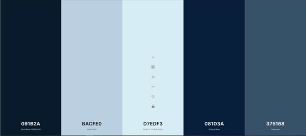
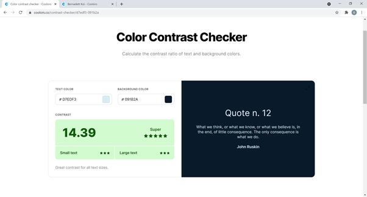
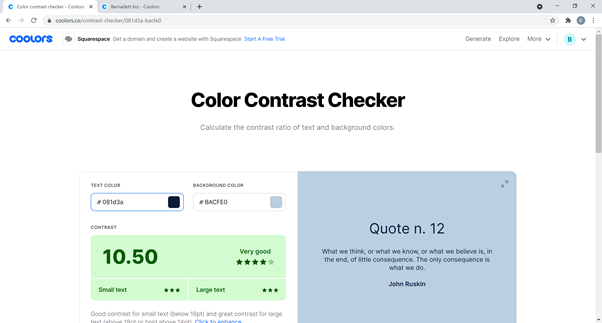

<div align="center"><h1>Game of Thrones Memory Game</h1></div>

<!-- Space for mockup -->

<!-- [View the live site here]() -->

<!-- [View the repository in GitHub here]() -->

## Project Goal

The Game of Thrones Memory Game has been created to give Game of Thrones or memory game enthusiasts the opportunity to have fun while finding the matching cards, though it is suitable for all age groups. As an added bonus, this game can also improve some brain functions such as attention, concentration and focus. In addition to developing one's visual recognition and short-term memory, it can also enhance a person's long-term memory, too, as per [Curious World](https://www.curiousworld.com/blog/importance-playing-memory-games).

This project is for educational purposes only and has been created for the Interactive Front-end Development module of Code Institute.

---

## User Experience (UX)

* ### User stories
    * #### User Goals

        1. I want to easily navigate the site, play again, or exit the game if I choose to, with one click.
        1. I want to understand the rules of the game.
        1. I want a game that is simple to play.
        1. I want to check my scores and my time so that I can compete with myself.
        1. I want the website to work well on tablet and mobile as I choose to play games while on the go or commuting.

* ### Design
    * #### Color Scheme
        The gloomy and cold colors of the Night's Watch have inspired me to use the below color palette which I made via [Coolors](https://coolors.co/).
        &nbsp;
        
        &nbsp;
        According [Color Psychology](https://coschedule.com/blog/color-psychology-marketing#blue) blue is associated with trust, dependability which are in line with a lot of the themes detectable in Game of Thrones. Whereas [white](https://coschedule.com/blog/color-psychology-marketing#white) or whiter shades of blue usually create a sense of purity, peace and cleanliness. Whereas [black](https://coschedule.com/blog/color-psychology-marketing#black) conveys seriousness, control, independence but it can carry mystery or death, which are also recurring elements in the series.
        &nbsp;
        The color contrast checker gave very good ratings for using #091B2A as a background color while using #D7EDF3 as the text color.
        &nbsp;
         I intended to use this combination for the main page, pop-ups and instructions. 
        &nbsp;
        I also liked the effect of using #BACFEO on buttons and juxaposing it with #081D3A when used as text color or on the footer.
        &nbsp;
        

    * ### Typography
        According to [Shmoop](https://www.shmoop.com/study-guides/literature/game-of-thrones-book/themes), there is a mixture of classic and contemporary themes characterising Game of Thrones, such as power, gender, betrayal, family, society and class, principles, coming of age, justice and judgement, memory and the past, strength and skill. I wanted my fonts to reflect this dichotomy so I decided to go with [Cinzel](https://fonts.google.com/specimen/Cinzel?preview.text=Winter%20is%20coming&preview.text_type=custom#glyphs) which resembles roman inscriptions, but also has a contemporary feel to it. I used [Montserrat](https://fonts.google.com/specimen/Montserrat#glyphs) for instructions and as the fallback font.
       
    * ### Structure
        
* ### Wireframes

    I used [Balsamiq](https://balsamiq.com/wireframes/desktop/docs/) when creating the wireframes for my website. 

    #### Desktop Wireframe - [View](./assets/wireframes/desktop-wireframe.png)
    #### Tablet Wireframe - [View](./assets/wireframes/tablet-wireframe.png)
    #### Mobile Wireframe - [View](./assets/wireframes/mobile-wireframe.png)
---
## Features
*  Responsive on all device sizes

### Existing Features

### Features Left to Implement
---
## Technologies Used

### Languages Used
- [HTML](https://en.wikipedia.org/wiki/HTML5)
- [CSS](https://en.wikipedia.org/wiki/CSS)
- [JavaScript](https://en.wikipedia.org/wiki/JavaScript)

### Frameworks, Libraries and Tools Used
1. [Bootstrap:](https://getbootstrap.com/docs/5.1/getting-started/introduction)
    Bootstrap was used to enable the responsiveness and assist with the styling of the website.
1. [jQuery:](https://jquery.com/)
    jQuery was part of the Bootstrap bundle and was incorporated in order to make the navbar responsive.
1. [Balsamiq:](https://balsamiq.com/wireframes/)
    Balsamiq was used to create the wireframes for the design before implementing them.
1. [Google Fonts:](https://fonts.google.com/)
    Google Fonts provided the inspiration for my font choices.
1. [Git:](https://git-scm.com/)
    Version control was maintained by applying Git via the Gitpod terminal to commit to Git and push to GitHub.
1. [GitPod:](https://www.gitpod.io/)
    The GitPod environment was used to develop the code before committing and pushing it to GitHub.
1. [GitHub:](https://github.com/)
    GitHub was utilised to store the project's code.

---
## Testing

### Validator Testing
1. [W3C Markup Validator](https://jigsaw.w3.org/css-validator/#validate_by_input) - [Results]()
1. [W3C CS Validator](https://jigsaw.w3.org/css-validator/#validate_by_input) - [Results]()
1. [JSHint](https://jshint.com/) - [Results]()
<!-- 1. The [WAVE Chrome Extension Tool](https://wave.webaim.org/extension/) was utilised to ensure better accessibility of each page of the website and made me add legend and label details to the Order and Contact page.-->

### Testing User stories from User Experience Section
* #### User Goals

The webpage was extensively tested on various devices and browsers. Any bugs related to these are noted in the **Bugs** section.

### Bugs

### Unfixed Bugs
---
## Deployment

### GitHub Pages
The site was deployed to GitHub pages. The steps to deploy are as follows:

1. Navigate to the repository on GitHub, then click **Settings**.
1. Click **Pages** in the left sidebar.
1. Under **GitHub Pages - Source** select the **Branch: master** drop-down menu and select a publishing source, then click **Save**.
1. The live website is available at <!---->
1. Any commits are pushed to GitHub which ensures that the GitHub Pages version gets updated in a timely manner.

### Making a Local Clone

1. On GitHub navigate to the main repository, click **Code**.
1. From the **Clone** options, use the **HTTPS** option and copy the link displayed.
1. Open your IDE and ensure you have a Git Terminal open.
1. Change the current working directory to the location where you want the cloned directory.
1. Type ```git clone```, then paste the URL you copied earlier.
1. Press **Enter** to create your local clone.

---
## Credits

### Code

I took some code snippets from 

### Content

* Reference in Project Goal: [Curious World](https://www.curiousworld.com/blog/importance-playing-memory-games).
* Inspirations for the memory game from two other students of Code Institute: [Daniella Minyo](https://daniellaminyo.github.io/Milestone-2/index.html) and [Christopher Goodfellow](https://tawnygoody.github.io/MS2-World-of-Rugby/).
* For the game instructions I used the wording from a solo matching game on [Memozor](https://www.memozor.com/memory-games/big-or-giant/forest).

### Design

* Inspirations for the memory game from two other students of Code Institute: [Daniella Minyo](https://daniellaminyo.github.io/Milestone-2/index.html) and [Christopher Goodfellow](https://tawnygoody.github.io/MS2-World-of-Rugby/).

### Media

 * The pictures on the website originate from Unsplash and  Shuttershock.

    * [Background image](https://unsplash.com/photos/qluz8quWa5Q)

    * [Backface image](https://www.shutterstock.com/image-vector/winter-wolf-poster-snow-head-symbol-1375656131)

    * [Image one by New vision](https://www.shutterstock.com/image-photo/metal-knight-swords-background-close-concept-572778259)

    * [Image two by Dream Expander](https://www.shutterstock.com/image-illustration/high-resolution-ice-dragon-3d-rendered-1478439548)

    * [Image three by Corona Borealis Studio](https://www.shutterstock.com/image-illustration/medieval-iron-throne-kings-made-weapons-1403501564)

    * [Image four by Smolina Marianna](https://www.shutterstock.com/image-photo/dark-hedges-armoy-northern-ireland-evening-305240981)

    * [Image five by SPF](https://www.shutterstock.com/image-illustration/blazing-flying-arrows-on-black-background-569326987)

    * [Image six by SPF](https://www.shutterstock.com/image-illustration/metal-sword-on-dark-background-snow-743441950)

    * [Image seven by tomertu](https://www.shutterstock.com/image-photo/mysteriousand-magical-image-womans-hand-holding-1149592505)

    * [Image eight by Elivagar ](https://www.shutterstock.com/image-vector/great-houses-minimalistic-icons-song-ice-692104405)

* All Shuttershock images have been downloaded as part of my standard license which authorise their limited usage in print, advertising, and packaging, and unlimited web distribution.

### Acknowledgements

<!--I would like to thank you to my Mentor for his helpful feedback, and also to the Slack community who had dealt with the same issues that I encountered during the development of this project. It was tremendously useful to have access to their previous challenges and their solutions. -->

